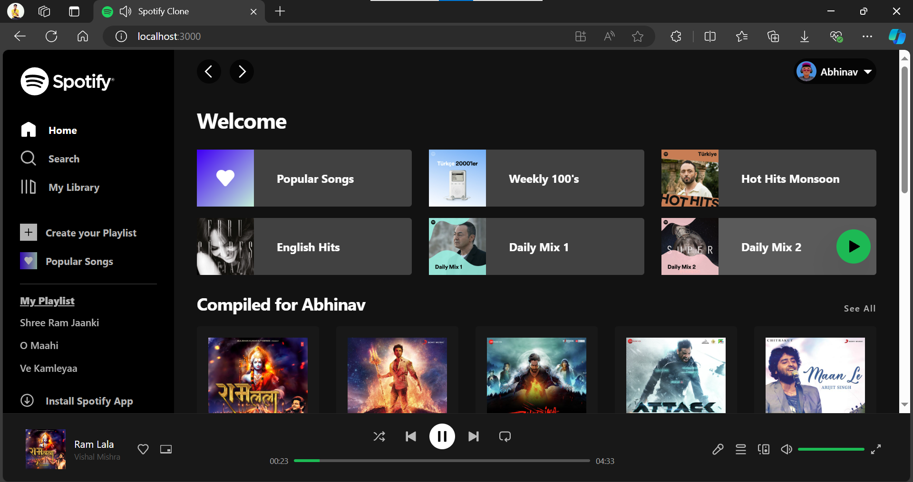

<div id="top"></div>

<!-- PROJECT LOGO -->
<br />
<div align="center">
  <a>
    
  </a>

  <h3 align="center">Spotify Clone</h3>
</div>

<!-- TABLE OF CONTENTS -->
<details>
  <summary>Table of Contents</summary>
  <ol>
    <li>
      <a href="#about-the-project">About The Project</a>
      <ul>
        <li><a href="#built-with">Built With</a></li>
      </ul>
    </li>
    <li>
      <a href="#getting-started">Getting Started</a>
      <ul>
        <li><a href="#prerequisites">Prerequisites</a></li>
        <li><a href="#installation">Installation</a></li>
      </ul>
    </li>
    <li><a href="#contact">Contact</a></li>
    <li><a href="#acknowledgments">Acknowledgments</a></li>
  </ol>
</details>

<!-- ABOUT THE PROJECT -->

## About The Project



<p align="right">(<a href="#top">back to top</a>)</p>

### Built With

All major frameworks used to start the project.

- [React.js](https://reactjs.org/)
- [Tailwind.css](https://tailwindcss.com/)
- [Redux Toolkit](https://redux-toolkit.js.org/)

<p align="right">(<a href="#top">back to top</a>)</p>

### Prerequisites

This is an example of how to list things you need to use the software and how to install them.

- npm
  ```sh
  npm install npm@latest -g
  ```

### Installation

_You must install the following:._

1. Install 'npm'
   ```sh
   npm install
   ```
1. Install Tailwind Css
   ```sh
   npm install -D tailwindcss
   ```
1. Tailwind.css init
   ```sh
   npx tailwindcss init
   ```
1. Run watch scrpits
   ```sh
   npm run watch
   ```
1. Npm start
   ```sh
   npm start
   ```

<p align="right">(<a href="#top">back to top</a>)</p>

## Contact

[LinkedIn](https://www.linkedin.com/in/abhinav-anand18)

<p align="right">(<a href="#top">back to top</a>)</p>

<!-- ACKNOWLEDGMENTS -->

## Acknowledgments

Resources I used while developing the project:

- [React Icons](https://react-icons.github.io/react-icons/search)
- [React Range](https://www.npmjs.com/package/react-range)
- [Headless Ui](https://headlessui.dev/)
- [React Router](https://reactrouter.com/)

<p align="right">(<a href="#top">back to top</a>)</p>
